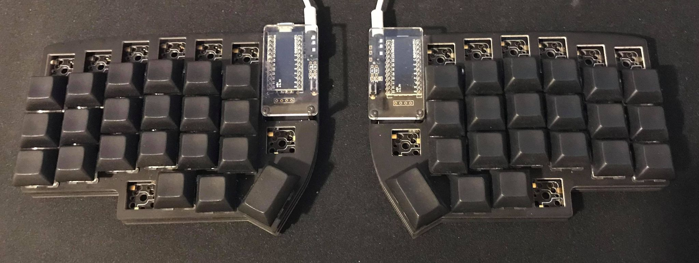

# lily58-to-corne



This is a keymap that can change Lily58 Pro to like Corne Cherry.

### Usage
**1. setup qmk_firmware**

refer [qmk_firmware](https://github.com/qmk/qmk_firmware/)

**2. clone this repository to qmk_firmware/keyboards/lily58/keymaps/corne**
```bash
cd qmk_firmware/keyboards/lily58/keymaps
git clone https://github.com/TakutoYoshikai/lily58-to-corne.git corne
```

**3. flush firmware**
```bash
make lily58:corne:avrdude
```

### License
MIT License
